# 高速公路智能服务区管理系统需求分析技术文档

## 一、引言

### 1. 项目背景介绍

随着我国交通基础设施的不断完善和社会经济的飞速发展，高速公路已成为我国重要的交通动脉之一，承担着大量的货物运输和人员出行任务。作为高速公路上不可或缺的基础设施，服务区的重要性日益凸显。服务区不仅是司机旅途中的休息和补给站，更是交通安全和便捷性的重要保障点。然而，随着交通网络的不断扩展和交通流量的增加，传统的服务区管理存在以下许多问题：

- **信息不对称**：传统服务区信息流动不畅，导致管理者和用户之间信息不对称，影响了服务质量和效率。

- **资源利用低效**：传统服务区管理方式下，资源利用率低下，难以满足日益增长的交通流量和用户需求。

- **安全隐患**：传统服务区管理存在安全隐患，如监控盲区、交通事故反应不及时等，需要引入智能化手段加以解决。

- **用户体验不佳**：服务区信息服务不够便捷、准确，用户体验较差，满意度不高。

### 2. 项目前景展望

随着智能技术的不断发展和应用，智能交通管理已经成为提升交通运输效率和安全性的重要途径之一。在此条件下，高速公路智能服务区管理系统应运而生。该系统整合了人工智能、物联网、大数据分析等先进技术，旨在实现对服务区的智能化管理和运营。该系统主要特性如下：

- **实时数据采集与监控**：通过物联网技术，实现对服务区各项数据的实时采集和监控，包括交通流量、停车情况、设施设备运行状态等。
- **智能决策与优化**：借助大数据分析和人工智能技术，对采集到的数据进行深度分析，为服务区管理者提供智能化的决策支持和运营优化建议。
- **安全监控与预警**：搭建全面的安全监控系统，实现对服务区安全隐患的实时监测和预警，提高应急响应能力和事故处理效率。
- **信息服务与用户体验提升**：通过智能化的信息发布系统，为用户提供个性化、实时的服务区信息和导航服务，提升用户体验和满意度。

### 3. 项目范围界定

本项目将围绕高速公路服务区的智能化管理展开，具体范围界定如下：

1. **人流量的动态统计**：系统需实时统计服务区内的人流量，包括不同时间段、不同区域的客流量，为服务区的运营决策提供数据支持。
2. **人员身份信息的采集和统计**：系统应能够采集并记录进入服务区人员的身份信息，包括车辆驾驶员和乘客的基本信息，用于安全管理和数据分析。
3. **车位、房位的动态统计**：系统需实时统计服务区内的车位和房位使用情况，包括空闲和占用状态，以便为旅客提供准确的停车和住宿信息。
4. **对设施设备运行情况的监控**：系统应实时监控服务区内的设施设备运行状态，如卫生间、餐厅、加油站等的运营情况，确保设施设备的正常运行和及时维护。
5. **商品的进货量、销售量统计**：系统需对服务区内的商品进货量、销售量进行统计和分析，为商品采购、库存管理和销售策略提供依据。
6. **智能决策与优化建议**：基于上述数据的分析，系统应能够提供智能决策支持，包括服务流程优化、资源配置建议等，以提升服务区的运营效率和服务质量。
7. **对服务区安全隐患的实时监测和预警**：系统应能够实时监测服务区内的安全隐患，如火灾、交通事故等，并及时发出预警，确保旅客和车辆的安全。
8. **用户行为分析和个性化推荐服务**：通过分析用户行为数据，系统应能够提供个性化的推荐服务，如餐饮推荐、住宿推荐等，以提升用户满意度和忠诚度。
9. **用户反馈的接收与统计**：系统应设置用户反馈渠道，收集用户对服务区的意见和建议，并进行统计和分析，以便及时改进服务质量。

## 二、数据收集与分析

### 1. 数据来源

我们通过**调查问卷**、**面谈**等形式收集了来自不同地区、不同年龄段的相关人群，包括

- **服务区管理人员**：负责统筹整个服务区的运行，下发调度的决策，来保证用户的体验
-  **一线工作人员**：负责进行服务区的日常工作任务，来保证服   务区的正常运行，学习接受的能力有限，听从管理人员的调度分配
- **司机和乘客**：服务区的主要用户，不需要使用系统，对当地的旅游和环境不熟悉
- **服务区商家**：负责统计商店里的数量和销售量，需要为其他人员提供商品销售服务数据预处理和清洗

### 2. 调查问卷结果分析

#### 1. 受访对象

本次问卷调查受访对象年龄主要为18~55岁，其中约56%的受访者掌握驾驶技能，约35%的受访者驾驶经验丰富。

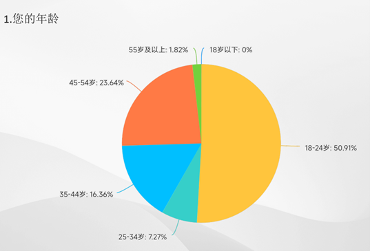

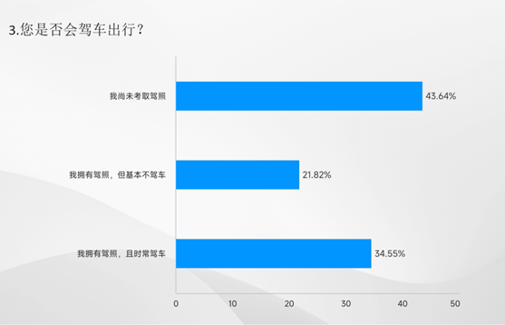

#### 2. 服务区使用体验

除约三分之一的受访者表示作为乘客时一般不提出前往服务区的需求外，多数受访者在司机和乘客两种身份下，都平均在连续驾车或乘车2小时后有前往服务区的意愿。

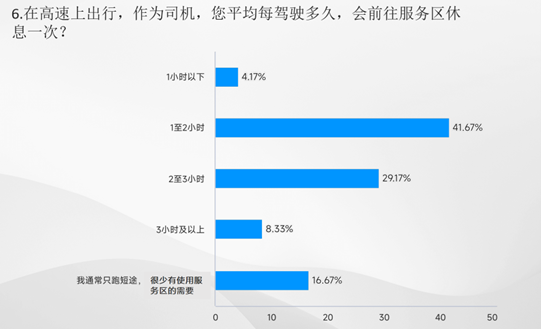

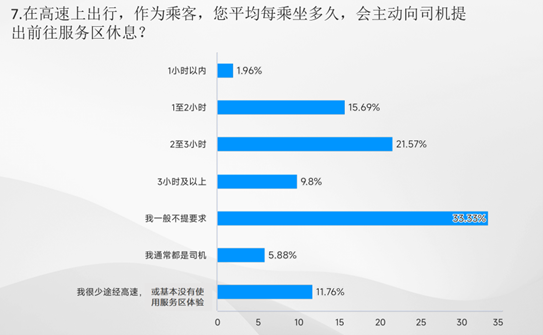

#### 3. 服务区使用情况及满意度

受访者在服务区现有职能中，最需要的服务为使用洗手间，其次为停车休息、餐饮服务和车辆加油/充电，服务区的其他职能则很少被使用。在各项服务中，基本的停车服务满意度最高，餐饮与购物服务的满意程度最低。

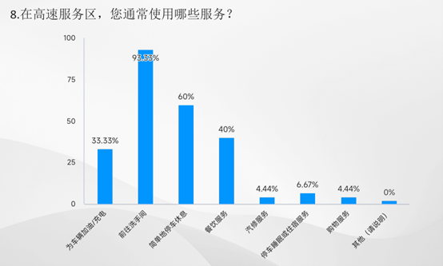

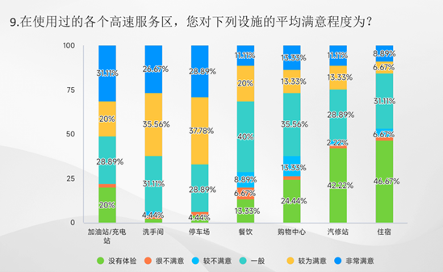

#### 4. 现有服务区的不足之处

对于受访者使用频率较高的加油站、洗手间和停车场，较不满意的普遍问题在于规模或运行效率不足。此外，停车场规划不合理引起人车冲突是一个突出问题。

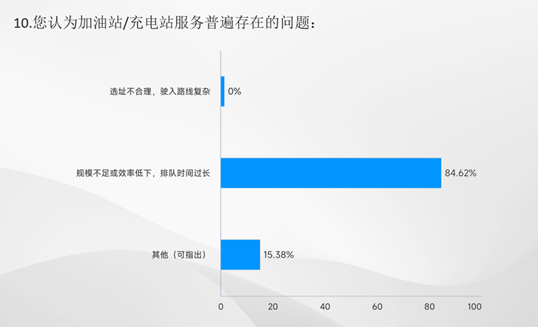

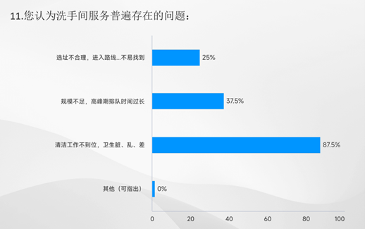

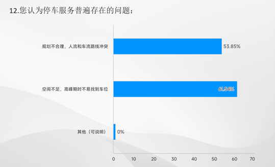

对于受访者使用频率较低的餐饮、购物、汽修和住宿等服务，较不满意的普遍问题在于服务质量和价格，且部分低规格服务区不具备良好的汽修服务和住宿条件。

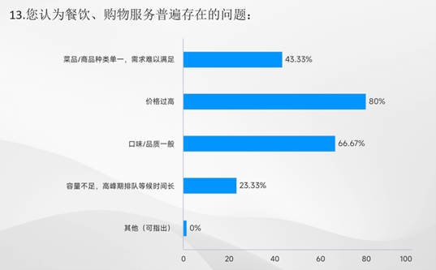

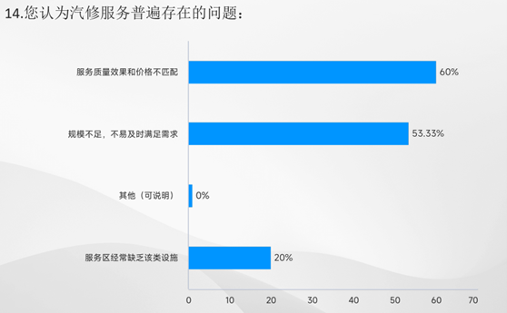

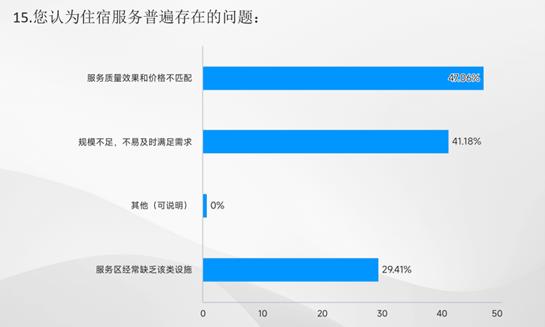

#### 5. 使用者意向

大多数受访者对智能服务系统的各个预期功能均表现出较浓厚的兴趣，其中应急服务请求（呼叫快速道路救援等）最受关注。

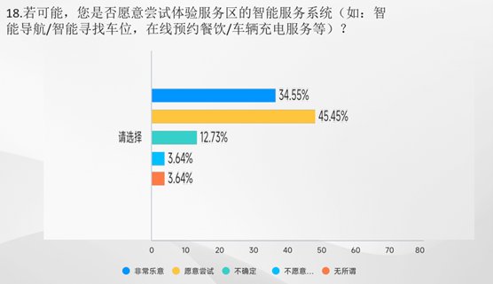

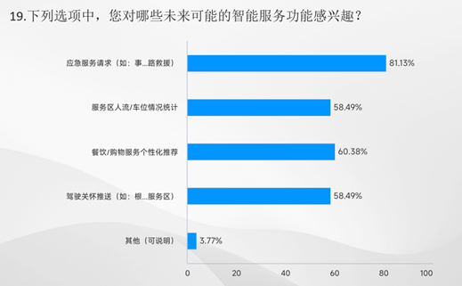

### 3. 面谈分析

#### 1. 第一次面谈

| **日期**     | **2024年3月23日**                  |
| ------------ | ---------------------------------- |
| **会见者**   | **甲方全体成员**                   |
| **被会见者** | **服务区行政人员**                 |
| **主题**     | **高速公路智能服务系统的可接入性** |

**会见目标** ：

> - 阐明服务区行政人员对于服务区与系统对接的融洽性观点
> - 获取服务区行政人员针对当前的服务区存在的管理调度问题
> - 获取服务区行政人员针对服务区功能实现的看法
> - 依据问卷获取的用户需求来取得甲方对用户需求内容的意见

**谈话要点**：

> - 服务区的物联网程度及智能系统的接入程度如何
> - 服务区的哪些功能存在欠缺或完善度不高
> - 服务区与服务区相关人员的管理调度的困难
> - 系统给出的各种功能的实现可能
> - 先前实行过的系统存在哪些已知问题

**被会见者的观点**：

> - 在关键功能区中有智能系统的接入，但各个系统的关联度较低
> - 服务区的一线人员的管理调度、商家人员的沟通等方面存在欠缺，需要 一个统一规划的系统
> - 甲方观点，系统所实现的各类功能：如智能规划选择最优服务区，高亮服务区的关键功能等都具有很好的前景
> - 先前实行过的系统有：对数据量没有很好的认识导致系统相关平台崩溃、对于用户的数据采集存在侵犯隐私问题、对于服务区的服务功能的真实性存疑

**下次会见的目标**：

> 明确一线工作人员对系统和与之协调的看法

####  2. 第二次面谈

| **日期**     | **2024年3月23日**                          |
| ------------ | ------------------------------------------ |
| **会见者**   | **甲方全体成员**                           |
| **被会见者** | **一线工作人员**                           |
| **主题**     | **高速公路智能服务系统在一线工作的调度性** |

**会见目标**：

> - 阐明一线工作人员对于本系统的态度：支持或提出意见
> - 获取一线工作人员针对当前的服务区存在的不满或满意
> - 获取一线工作人员对系统的功能存在哪些需求

 **谈话要点**：

> - 系统在哪些方面对一线工作人员有帮助/阻碍
> - 一线工作人员对当前服务区的管理制度有什么看法
> - 一线工作人员对目前服务区已接入的各类系统的态度

**被会见者的观点**：

> - 被会见者首先关注的是新管理系统的接入对工作人数是否存在缩减，如仅是方便工作，对系统持积极态度
> - 一线工作人员认为目前的管理制度存在调度和消息传递效率问题
> - 被会见者对目前服务区各类系统存在便利性问题，认为当前的各类系统部分繁琐，部分系统之间的信息传递繁琐等问题

**下次会见的目标**：

> 明确司机和乘客对于系统给出的服务区信息和推荐的态度

####  3. 第三次面谈

| **日期**     | **2024年3月23日**                        |
| ------------ | ---------------------------------------- |
| **会见者**   | **甲方全体成员**                         |
| **被会见者** | **司机和乘客**                           |
| **主题**     | **高速公路智能服务系统的实用性和便利性** |

**会见目标** ：

> - 阐明司机和乘客对于本系统能否优化服务的看法
> - 获取司机和乘客对服务区的偏好
> - 获取司机和乘针对系统前景功能的满意度

**谈话要点**：

> 本系统的功能是否给司机和乘客带来了实用的便利
>
> 司机和乘客对服务区有哪些偏好，能接受系统如何获取这些偏好
>
> 系统功能实现是否提供了实际的便利

**被会见者的观点**：

> 被会见者提出了界面的简洁性、用户的隐私安全、智能决策符合需求等司机和乘客关注的问题
>
> 司机和乘客提出服务区的推荐需基于个体差异，存在偏好观念，可以进行偏好设置，如住宿、购物等功能偏好，及服务偏好等
>
> 被会见者提出了系统应实现明确服务区的具体服务功能提示，整体上认可系统提供的便利性

**下次会见的目标**：

> 依据本次面谈完善或实现的功能，获取各类涉众存在的问题和满意度

## 三、需求分析

### 1. 用户需求

1. 在高速行驶途中，**未进入服务区时**，智能服务平台应具有下列功能：
   1. 根据用户设置的个人经过服务区的频率习惯和沿途各服务区的人流信息，自动推荐建议用户驶入的服务区
   2. 对于排队可能性高的服务项目（如新能源汽车所需的充电），根据人流和道路车流综合数据给出用户抵达后的预计排队时间，供用户进行决策
   3. 展示各个服务区可提供的非一般需求服务（汽修、住宿等设施）的规格，避免用户在进入某一服务区后发现自身需求无法被满足
   4. 提供高效率的道路救援呼叫服务
2. **进入服务区内部后**，智能服务平台应具有下列功能：
   1. 提供停车场空余车位分布和最佳的驶入路线，减少用户停车时间
   2. 提供通向服务区内各个设施的实时步行导航，减少人车冲突和用户等待时间
   3. 展示各个公共设施的实时人流数据，供用户预知排队情况
   4. 展示餐饮、购物、住宿等设施提供的服务内容（例如菜品、商品和其价目表）与相关评价反馈，便于用户根据需求精准获取服务。
3. 智能服务平台提供的数据和信息**应当和其他道路交通信息系统**（如导航应用）**互通**，或该平台应当整合这些系统的功能，因为司机在驾驶车辆的过程中难以同时操作多个应用程序。


### 3. 性能需求

1. **面向一般用户**

   全系统应当满足近年全国高速节假日期间日均客车流量（并非人流量）的 40% 的人数的同时在线；

   对于单条高速公路的新闻推送系统，要求满足3万名一般用户的同时在线，每分钟处理能力5000条；

   单个服务预定、服务区信息系统要求满足2000名一般用户同时在线，每分钟处理能力2000条；

   单个服务区的道路救援呼叫系统要求满足200名一般用户同时在线，每分钟处理能力200条；

2. **面向管理员用户**

   全系统应当满足全国高速服务区管理人员人数的100%的人数的同时在线；

   对于单个服务区的所有管理系统要求满足20名管理员的同时在线；

   任一管理员使用满足推荐配置的设备的情况下，当系统至少有25％的空闲资源时，95％的目录数据库查询必须在3秒内完成；

   当系统繁忙时，优先满足管理员用户的使用；

3. **面向系统**

   保证系统的稳定性，当访问量超过可满足的容量时的繁忙状态下，系统不至发生崩溃或丢失已有数据；

   系统正常工作时，所有操作的响应时间应当在 800 ms 内；

### 4. 质量属性

1. **业务规则身份认证**

   系统设定了灵活的身份认证机制，所有用户均可尝试管理员身份认证，一旦通过，便拥有切换使用一般用户和管理员界面的权限，否则仅限于一般用户功能。

2. **安全性需求保障**

   为保障系统安全，实施了多层防护措施，包括登录密码策略、验证码机制及管理员操作监控，有效预防未授权访问和系统滥用情况的发生。

3. **系统可维护性与可靠性**

   在确保不影响系统稳定性前提下，支持功能的平滑增补；同时强调系统的高可靠性，要求在未受攻击状态下，平均致命故障间隔超过三年。

### 5. 安全性需求

1. **登录安全性**

   系统应当能抵御基本的、没有技术难度的数据库攻击和其他信息系统攻击。

2. **密码策略严格性**

   系统允许使用密码或验证码登录，所有用户在注册后自动设置默认密码并登录，但此后的3天内需要设置密码，否则无法再次使用密码登录。不允许设置和默认密码一致或过于简单（仅由一段相同或顺序排列的数字、字母组成）的密码。

3. **管理员操作监控与状态管理**

    管理员用户以管理员身份登录后，更高层的内部管理系统将会收到信息，且管理员用户在信息管理系统中进行的操作被实时监测记录，若存在异常（例如，连续发布大量的新闻通告）则自动冻结管理员身份并进行报告。一般用户身份下每次登录后登录状态持续30天，但管理员用户在管理员身份下退出系统后登录状态立刻结束，且每次由一般用户身份切换至管理员用户身份均需要重新登录（不需要重新验证）。

### 6. 其他需求

1. **系统可维护性**

   系统设计需考虑后续的可维护性，即在增加新功能或进行修改时，应确保不破坏现有架构和可靠性。这要求系统有良好的模块化设计和文档支持。

2. **系统可靠性**

   系统的可靠性至关重要，它要求在未遭受攻击的情况下，整个系统能够稳定运行，平均致命故障间隔时间必须超过3年，以确保用户对系统的信任和依赖。

3. **易用性与用户界面**

   系统应易于使用，管理员用户在不超过30分钟培训后能熟练操作所有功能，而至少90%的初中以上文化水平用户在阅读一次用户手册后能理解如何操作，且用户界面需简洁明了，方便用户快速找到所需功能。


## 四、原型设计

### 1. 结构化分析

#### DFD上下文图

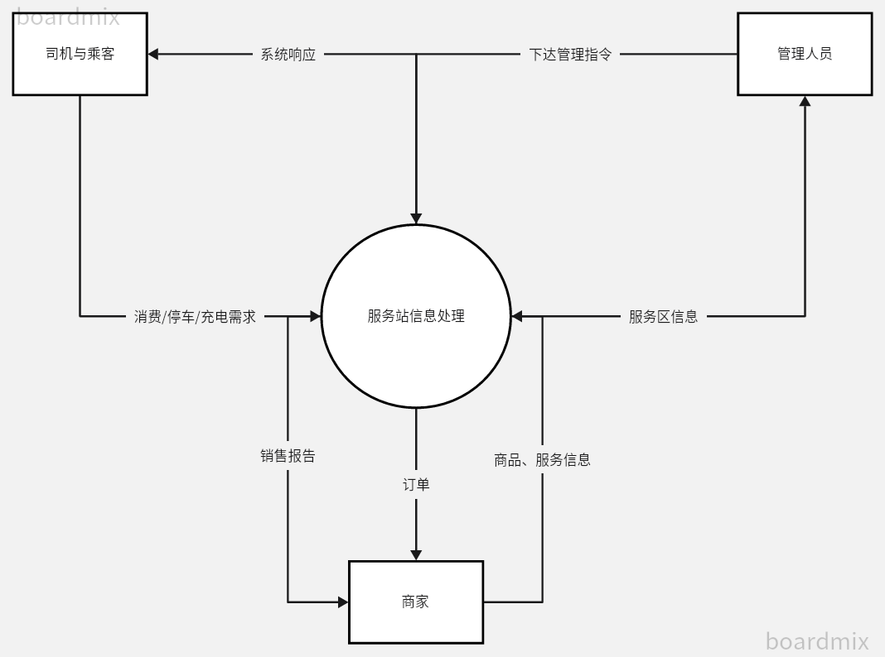

#### DFD0层图

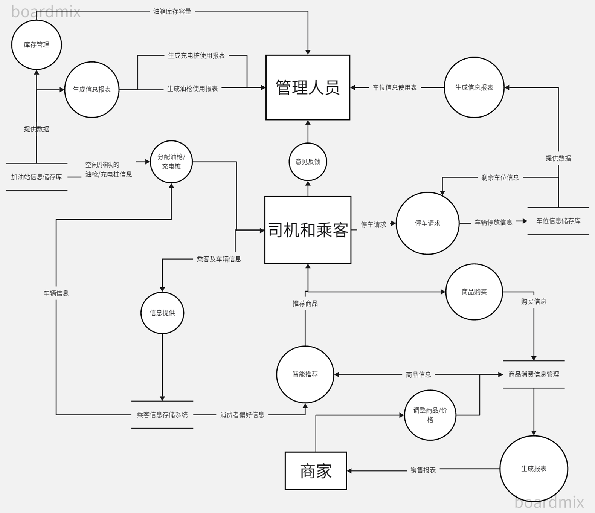

#### DFD1层图及微规格说明

**1. 停车部分**

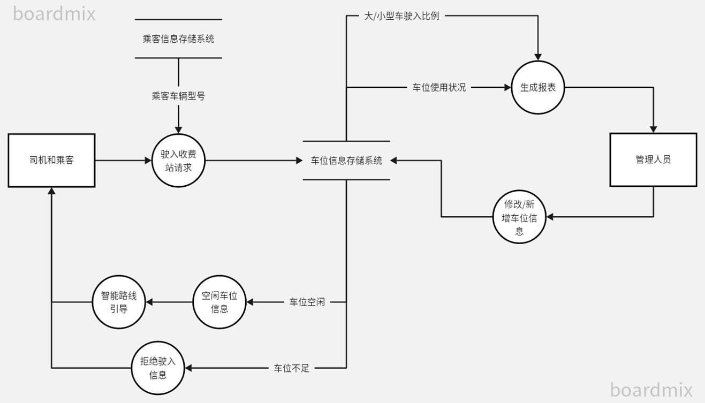

**结构化英语/伪代码**

```
ELECTED parkingSpace AND state == empty FROM storageSystem RETURN spaceNum
IF spaceNum == 0
    Reject this car;
ELSE
    Send spaceName;
    Send way to spaceName;
ENDIF
```


**2. 加油部分**

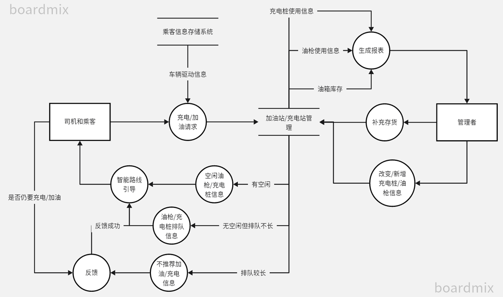

**结构化英语/伪代码**

```
GET this car’s type;
SWITCH (type) {

CASE ‘fuel powered’:
    SELECT fuelSpace FROM energySystem;
    IF empty
        Send spaceName;
        Send way to spaceName;
    ELSE IF full
        SELECT waitingLine FROM fuelSpace;
        IF line <= 5
            Send spaceName;
            Send way to spaceName;
        ELSE
            Send “whether insist” to customers;
            IF answer == yes
                Send spaceName;
                Send way to spaceName;
            ENDIF
        ENDIF
    ENDIF

CASE ‘electric powered’:
    SELECTED electricSpace FROM energySystem;
    IF empty
        Send spaceName;
        Send way to spaceName;
    ELSE IF full
        SELECT waitingLine FROM electricSpace;
        IF line <= 5
            Send spaceName;
            Send way to spaceName;
        ELSE
            Send “whether insist” to customers;
            IF answer == yes
                Send spaceName;
                Send way to spaceName;
            ENDIF
        ENDIF
    ENDIF

}
```


**3. 商品部分**

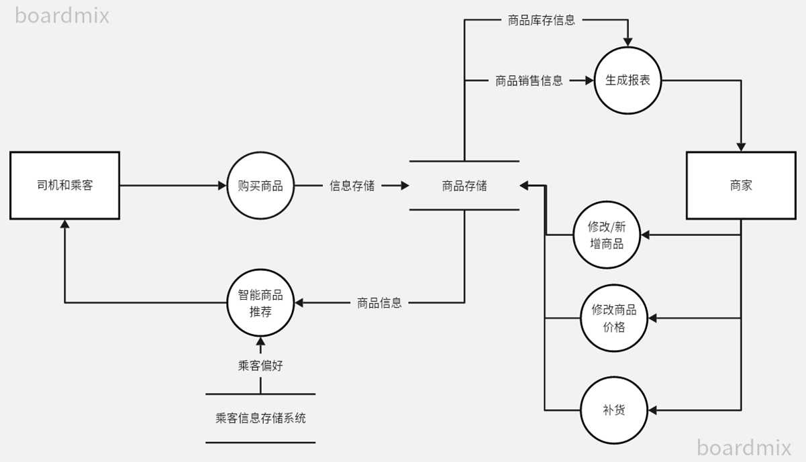


**4. 反馈部分**


### 2. 用例图

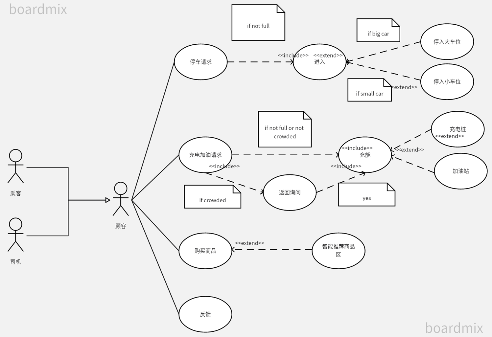

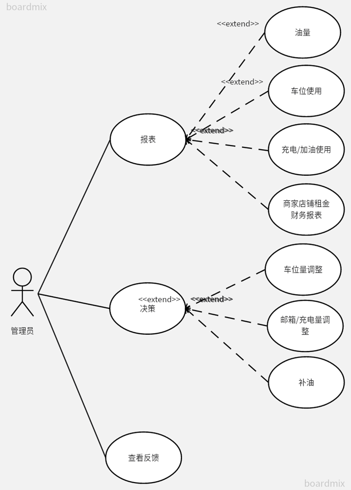

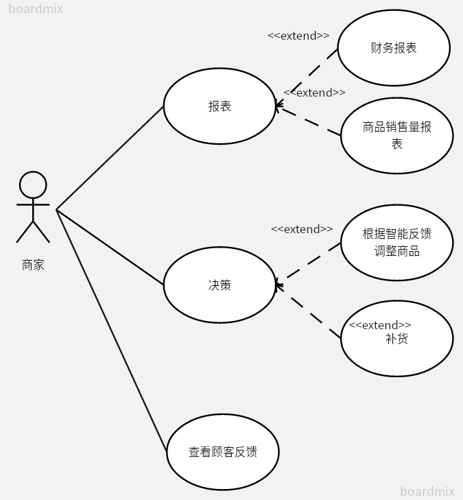

### 3. 静态模型

**类图**

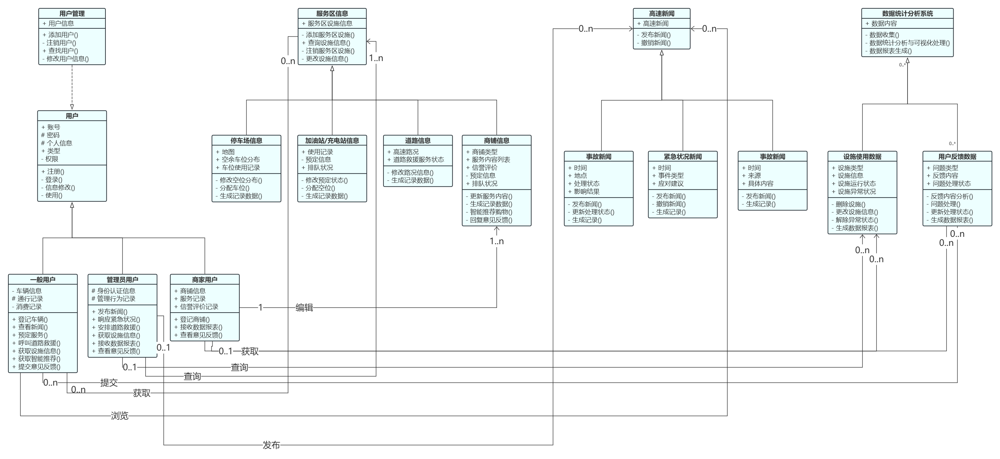

**包图**

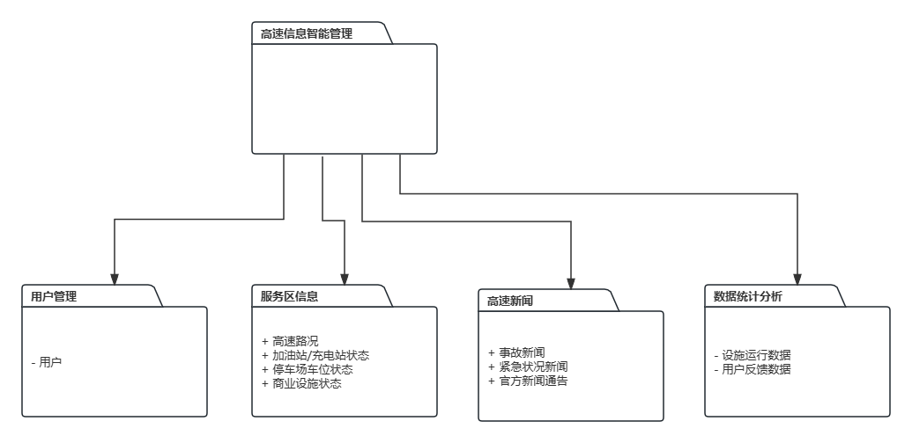

### 4. 动态模型

**顺序图**

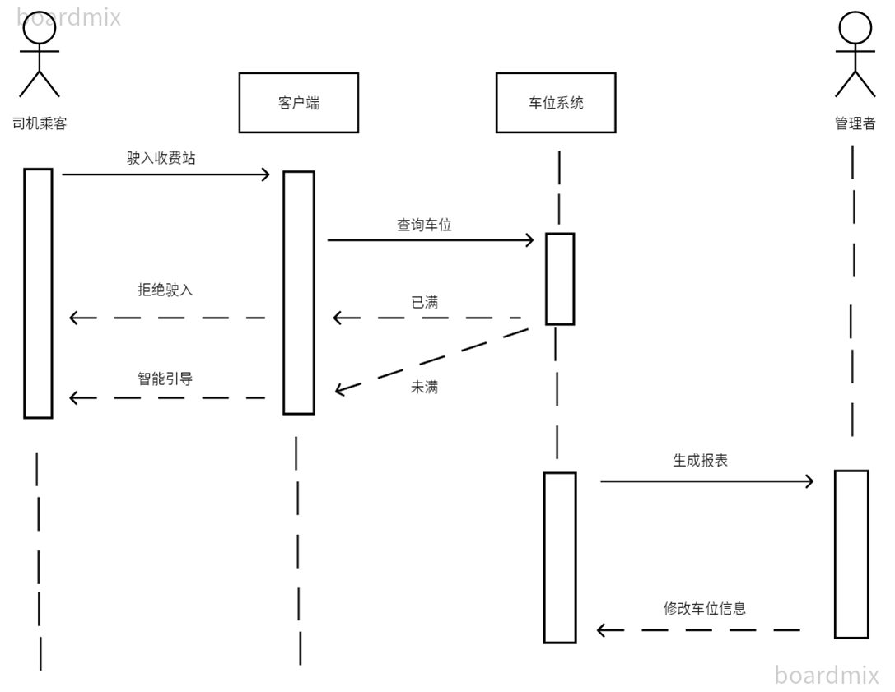

**活动图**

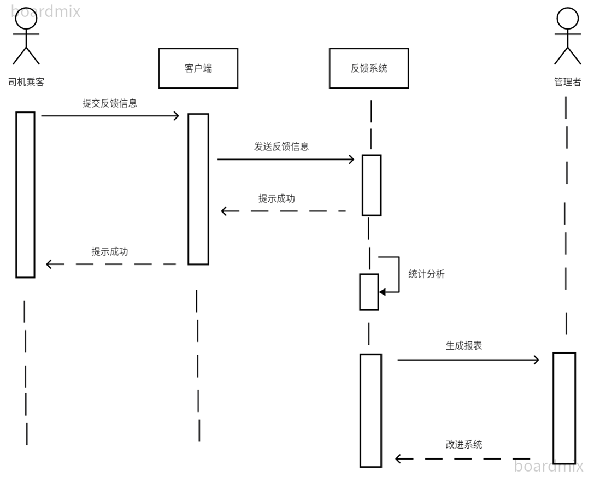

### 3. 对外接口实现

#### 1. 用户界面设计

用户界面设计注重用户体验，采用简洁明了的平面图形设计风格，以蓝色为主题颜色，同时提供深色模式。使用标准响应式布局，确保在不同设备上都能良好呈现。

1. **产品系列风格下的图形用户界面（GUI）标准：**

   采用现代的平面图形设计风格，要求图标简洁且有辨识度、字体清晰；

   要求配色方案令人感到舒适和易读；建议采用较深的蓝色为主题颜色，因为

    i 蓝色具有和安全相关的联系，且符合服务平台的正式感；

    ii 蓝色在环境亮度较高时易于被设备屏幕显示，易读性较强。

   建议同时提供深色模式的主题配色方案和图标，便于用户在夜间使用系统。

2. **屏幕布局和解决方案限制：**

   使用标准响应式布局，保证用户界面在不同长宽比例和分辨率的屏幕上都能良好呈现。

   所有用户界面应当简洁明了，让用户能够快速定位到所需要的功能的链接。

3. **按钮、功能或导航链接**

   1. **一般用户部分**

      1. **主页**：包括用户定位信息和由定位信息自动推送的当前高速相关的重要新闻（如某服务区暂停某服务、某路段发生某事故），智能个性化推送资讯的链接，以及道路救援、服务预定、服务区信息、导航、个人中心、设置等链接。
      2. **道路救援页面**：显示道路救援呼叫系统。
      3. **服务预定页面**：显示住宿、餐饮、汽修等预定需求较强的服务的预定和服务记录系统。
      4. **服务区信息页面**：在选定特定服务区后，显示服务区地图、可提供服务项目、停车场空余车位分布、卫生间和商店等公共设施的人流排队、服务内容等状况的信息清单。服务预定页面和服务区信息页面中各项服务内容应当给出用户评价反馈系统的链接，每项服务内容的提供商通过网页上传并管理其能提供的服务项目和信息。
      5. **导航页面**：显示外部链接并打开其他现有的地图应用中的高速路线和导航功能。

   2. **管理员部分**

      1. **主页**：包括用户定位信息和由定位信息自动推送的当前辖区重要内部通知的链接，灾害和紧急情况相关资讯链接，以及高速公路信息、服务区信息、信息管理、个人中心、设置等链接。
      2. **高速公路信息页面**：显示辖区内高速公路车流状况和紧急情况（如交通事故、道路损毁等）信息，道路救援服务系统的响应和处理情况与历史记录等。
      3. **服务区信息页面**：显示选定的服务区中的人流、车流情况，服务区内各服务设施运行情况，紧急情况（如火灾事故等）以及一般用户评价反馈的分析系统。
      4. **信息管理页面**：显示向一般用户发布新闻通告等功能的信息管理系统。

   3. **通用部分**

      1. **个人中心页面**：包含登录登出，管理员身份认证，高速公路通行记录和反馈记录等账户个人信息，绑定车辆，修改账户用户名、密码等功能。
      2. **设置页面**：包括应用系统参数、通知提醒的设置等功能。

   4. **错误信息显示**

      用户进行错误操作（例如非法的账号输入）时，通过弹出提示框或在对应操作处显示红色的文本清晰地提示错误信息，并提供解决方案或纠错建议。错误信息和解决方案、纠错的提示都应当使用通俗的、易于迅速理解的语言。

#### 2. 用户界面示意图

**管理端**

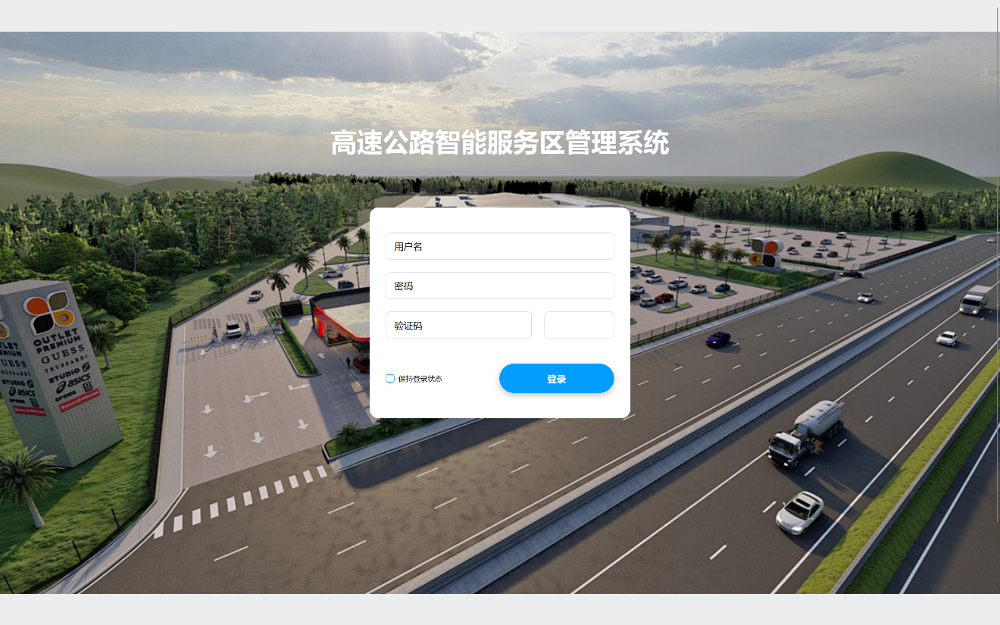

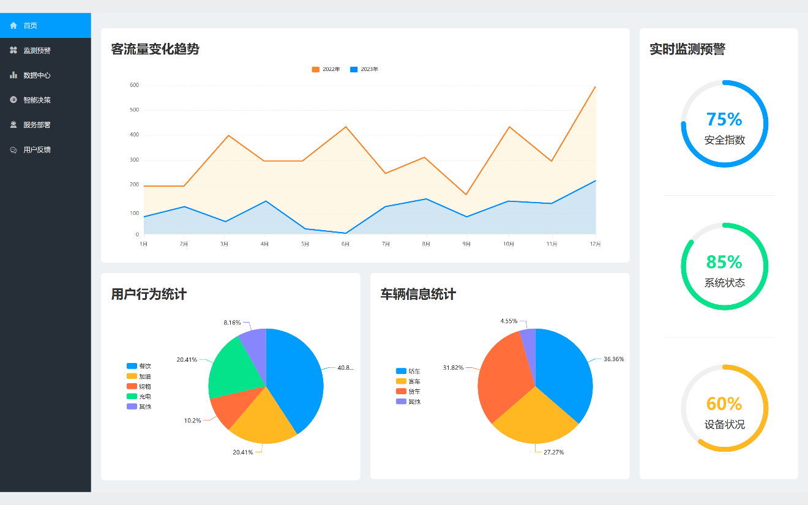

**客户端**

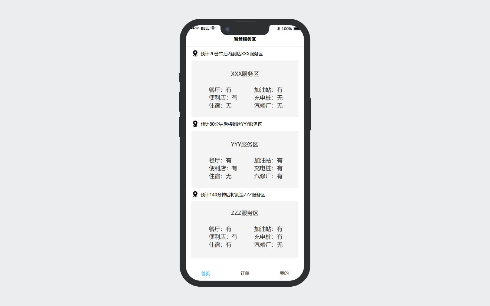


#### 3. 软硬件接口以及通信

1. **软件接口**

   要求后端以Springboot3框架开发，通过Tomcat服务器接收前端请求，在业务层进行功能实现。使用Mybati3实现JDBC，进行对数据库的操作。

2. **硬件接口**

   前端应用使用Telephony API与硬件进行数据交互和智能控制，实现监听电话状态、联网控制等必要功能。

3. **通信接口**

   前后端间使用HTTPS协议通信，设备主动从服务器获取所需数据。采用SHA-2或SHA-3算法进行加密。数据传输速率不低于200Mbps。


### 4. 算法设计

#### 1. 人工智能物联网技术

人工智能物联网技术通过收集和分析来自不同维度的海量数据，实现万物数据化、智联化。在智慧服务区建设中，利用智能物联网关与终端设备连接，采集多源数据，并在边缘端建立标准结构化数据，通过人工智能、大数据分析初步计算有助于减少需要传输到数据中枢的数据量。

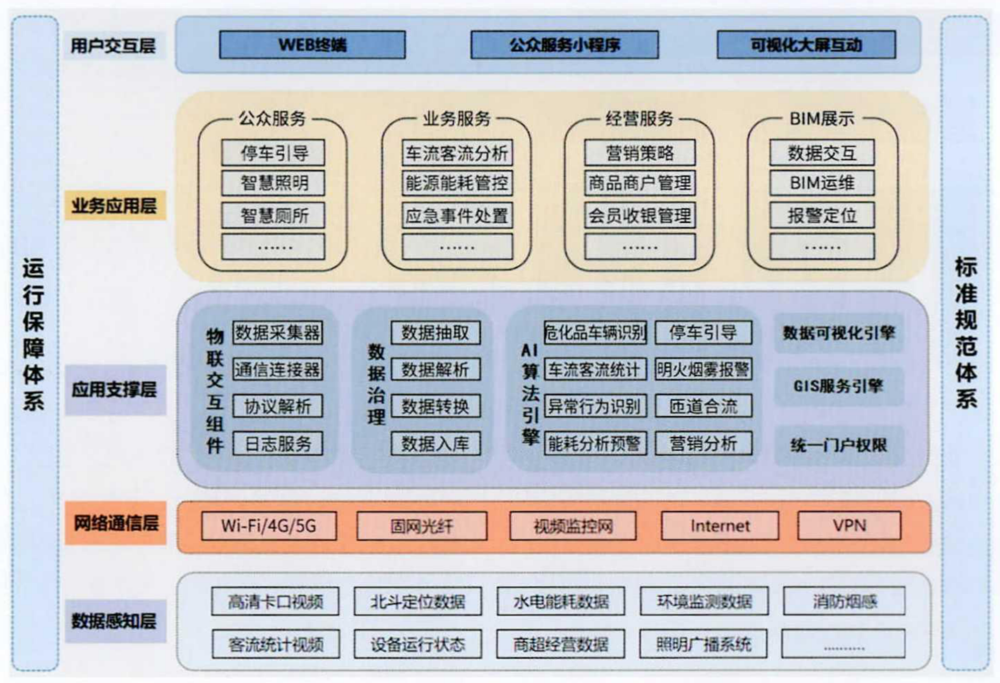

#### 2. GIS+BIM数字化运营技术

GIS+BIM的数字化运营技术通过三维建模，构建服务区物理实体在数字世界中对应实体场景。运用服务区实体中各种物联网传感器和智能终端实时获得的数据，对服务区基础设施、环境状态、能源能耗、设备状态、经营数据等信息进行实时监测和三维实景方式呈现，为服务区运营管理提供数字化、可视化、智慧化的能力支撑。

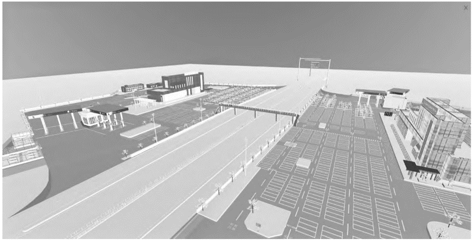

#### 3. 基于动态时空图神经网络的服务区流量预测

使用了一种动态时空图神经网络模型，该模型使用感知趋势性变化的多头注意力模块捕获流量数据在时间维度的动态性，通过空间动态图卷积模块捕获驶入服务区的车流量与路网中其他断面流量的动态相关性和空间异质性。基于时空位置嵌入表示，考虑了流量数据在时间维度的顺序性和空间维度的静态属性。模型基于编码器-解码器结构，通过反向传播实现端到端的训练。

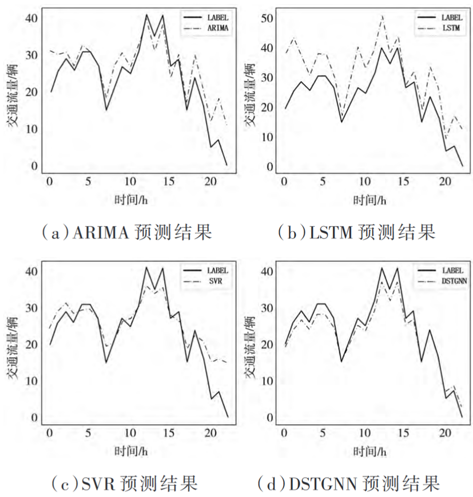

#### 4. 基于深度学习的服务区车位检测算法

该算法通过道路分割，确定停车区域及各类车辆的停放位置。利用深度学习技术，准确识别各停车区域的位置和范围。根据各区域的先验车位数，该算法能实时计算出剩余车位数，便于驾驶员了解当前的停车情况。这种计算方式简单而有效，为驾驶员提供准确的停车信息。

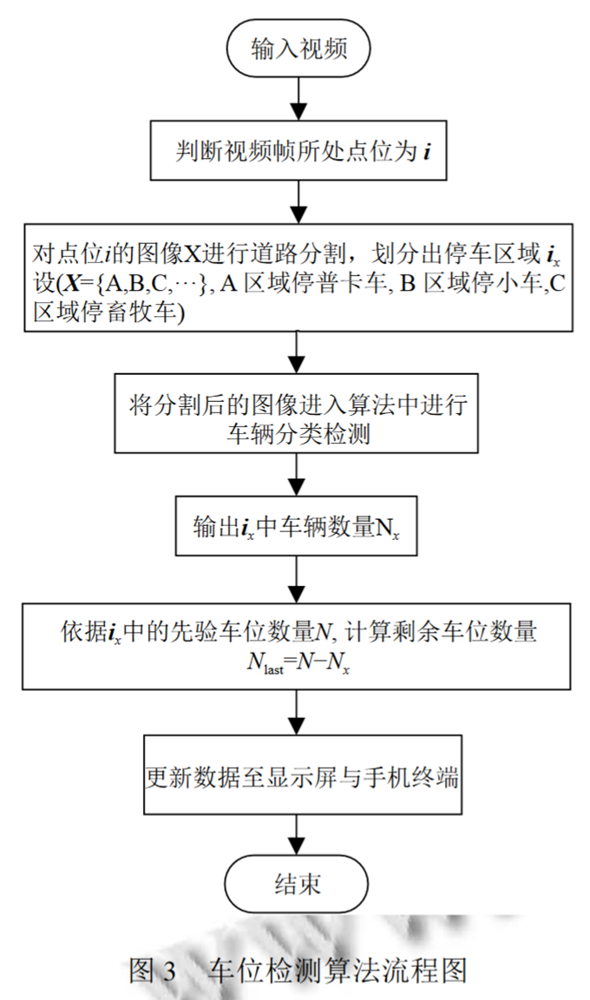
