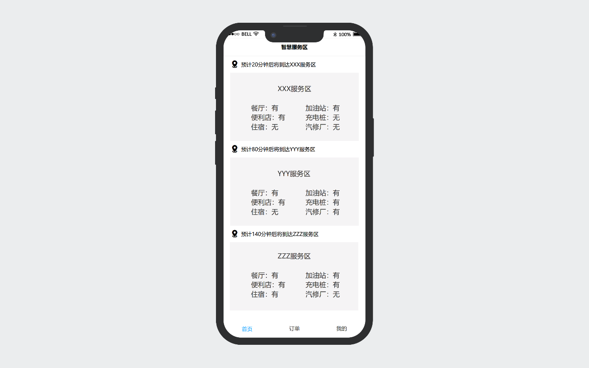
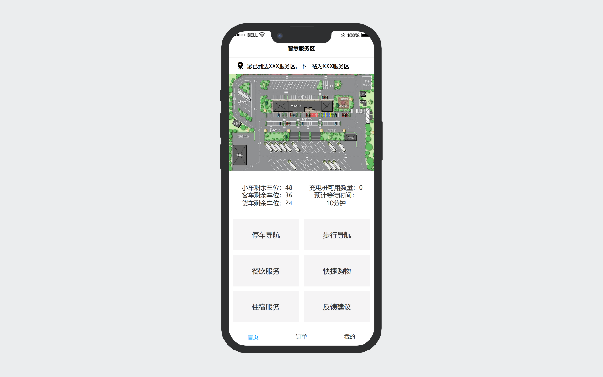
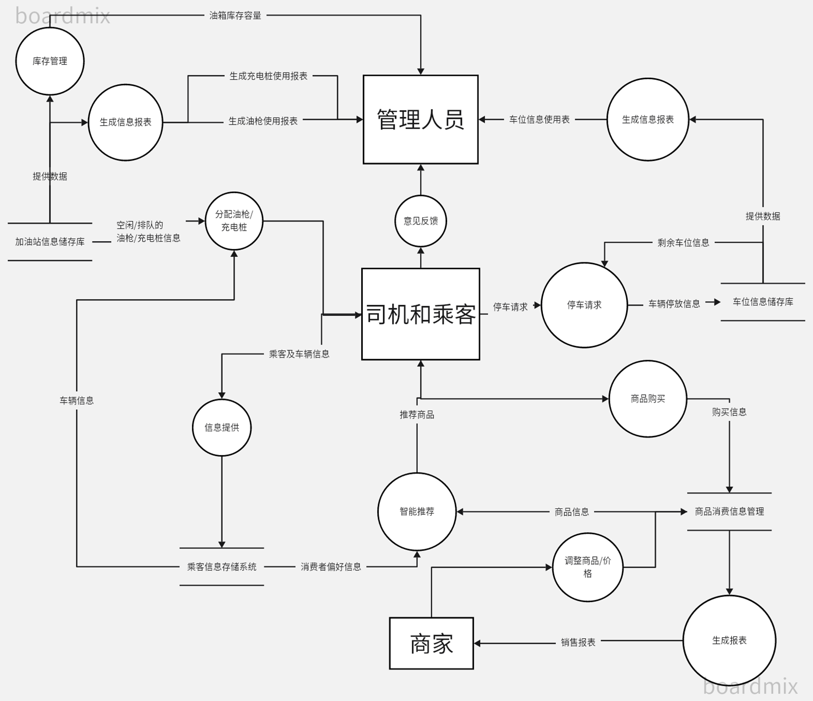
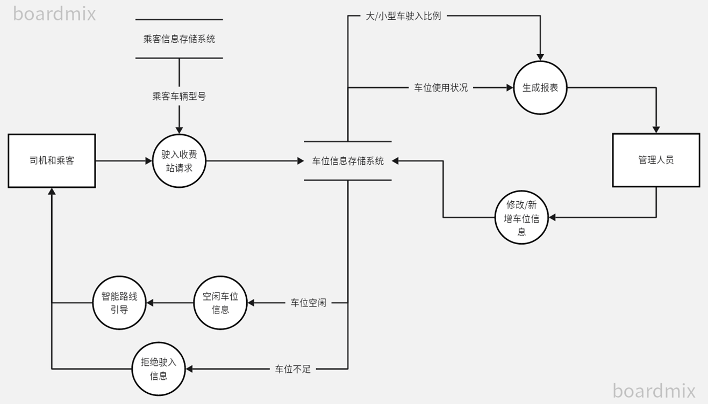
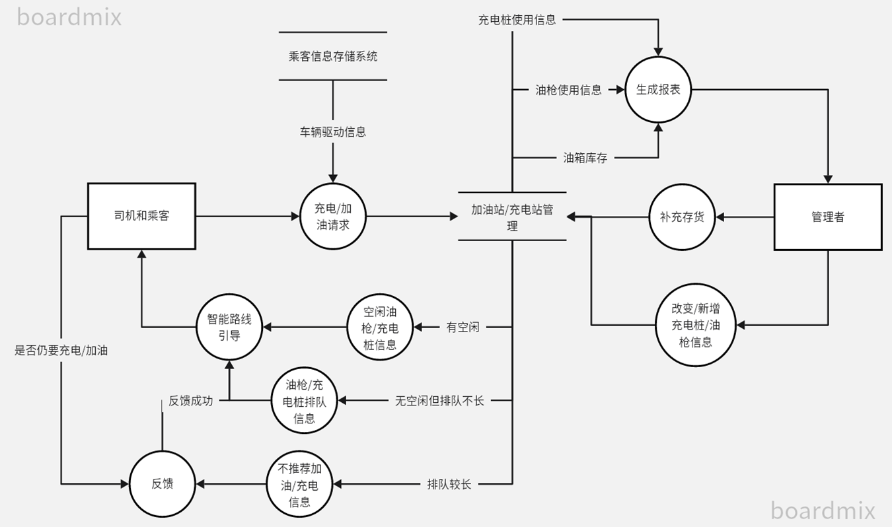
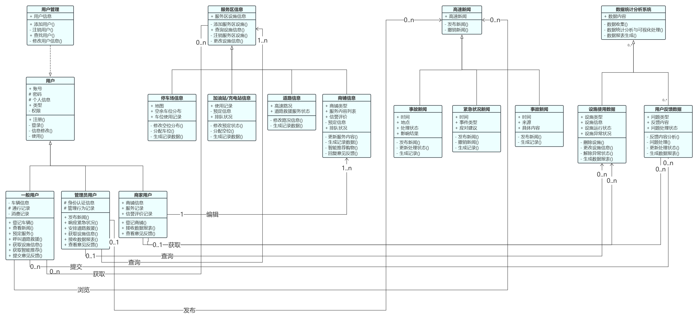
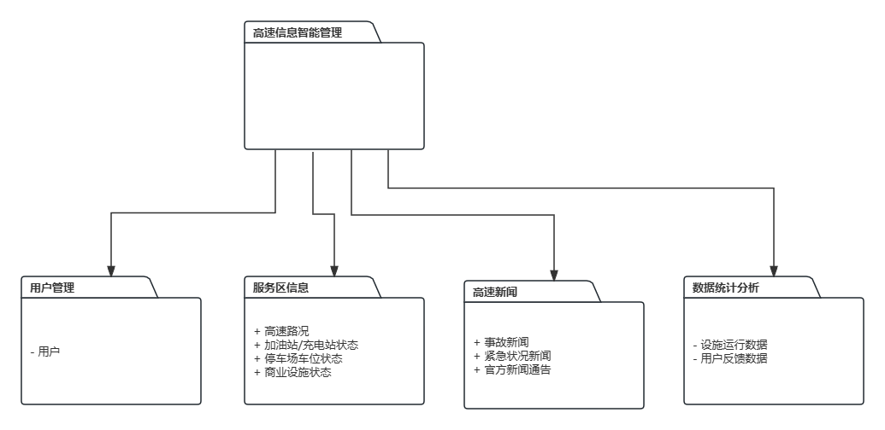
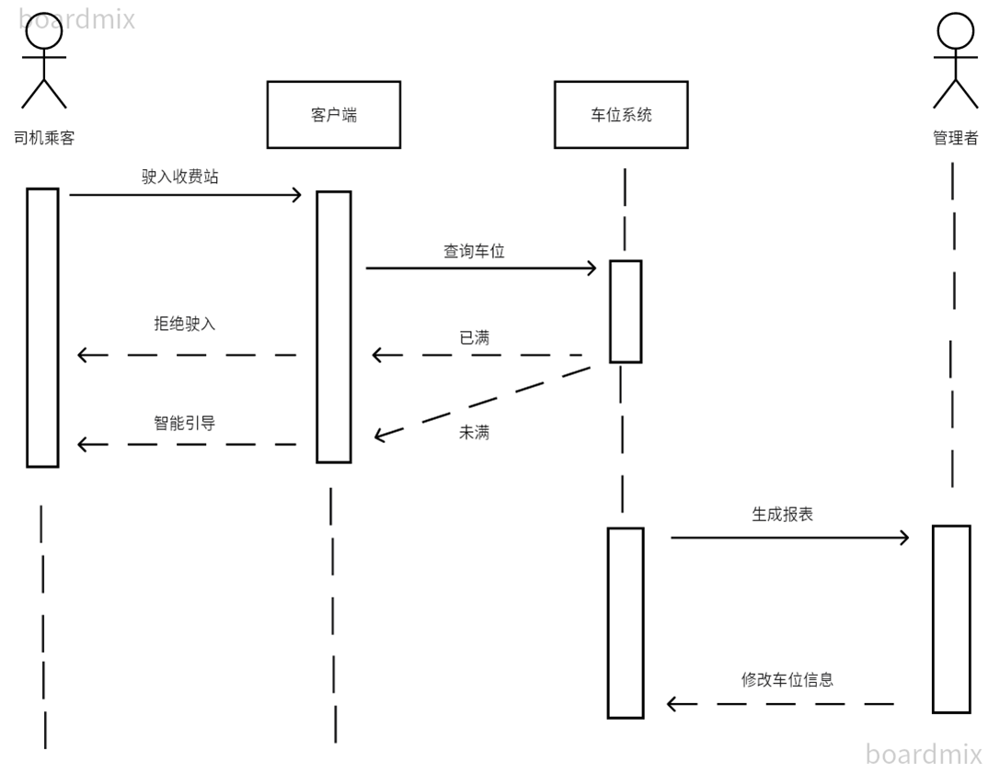

### 目录

[引言](# a. 引言)

- [背景及目的](# a.1 背景及目的)
- [文档约定](# a.2 文档约定)
- [预期的读者和阅读建议](# a.3 预期的读者和阅读建议)
- [产品的范围](# a.4 产品的范围)
- [参考文献](# a.5 参考文献)

[综合描述](# b. 综合描述)

- [产品的前景](# b.1 产品的前景)
- [产品的功能](# b.2 产品的功能)
- [用户类和特征](# b.3 用户类和特征)
- [运行环境](# b.4 运行环境)
- [设计和实现上的限制](# b.5 设计和实现上的限制)
- [假设和依赖](# b.6 假设和依赖)

[外部接口需求](# c. 外部接口需求)

- [用户界面](# c.1 用户界面)
- [硬件接口](# c.2 硬件接口)
- [软件接口](# c.3 软件接口)
- [通信接口](# c.4 通信接口)

[系统特性](# d. 系统特性)

- [说明和优先级](# d.1 说明和优先级)
- [激励/响应序列](# d.2 激励/响应序列)
- [功能需求](# d.3 功能需求)
- [系统功能图](# d.4 系统功能图)

[其他功能需求](# e. 其他功能需求)

- [性能需求](# e.1 性能需求)
- [安全设施需求](# e.2 安全设施需求)
- [安全性需求](# e.3 安全性需求)
- [软件质量标3准属性](# e.4 软件质量标准属性)
- [业务规则](# e.5 业务规则)

[其他需求](# f. 其他需求)

[人机交互页面](# 人机交互页面)

[附录 A：成员分工](# 附录 A：成员分工)

[附录 B：分析模型](# 附录 B：分析模型)

- [事件表](# 事件表)
- [结构化分析](# 结构化分析)
- [面向对象分析](# 面向对象分析)

[附录 C：待确定问题的列表](# 附录 C：待确定问题的列表)

# a. 引言

## a.1 背景及目的

随着我国交通基础设施的不断完善和社会经济的飞速发展，高速公路已成为我国重要的交通动脉之一，承担着大量的货物运输和人员出行任务。作为高速公路上不可或缺的基础设施，服务区的重要性日益凸显。服务区不仅是司机旅途中的休息和补给站，更是交通安全和便捷性的重要保障点。

然而，随着交通网络的不断扩展和交通流量的增加，传统的服务区管理存在以下许多问题：

- 信息不对称：传统服务区信息流动不畅，导致管理者和用户之间信息不对称，影响了服务质量和效率。

- 资源利用低效：传统服务区管理方式下，资源利用率低下，难以满足日益增长的交通流量和用户需求。

- 安全隐患：传统服务区管理存在安全隐患，如监控盲区、交通事故反应不及时等，需要引入智能化手段加以解决。

- 用户体验不佳：服务区信息服务不够便捷、准确，用户体验较差，满意度不高。

可见，传统的服务区管理方式已经难以满足人们日益增长的需求，需要采用智能化的手段来提升管理效率和服务水平。

当前，随着智能技术的不断发展和应用，智能交通管理已经成为提升交通运输效率和安全性的重要途径之一。在此条件下，高速公路智能服务区管理系统应运而生。该系统整合了人工智能、物联网、大数据分析等先进技术，旨在实现对服务区的智能化管理和运营。

## a.2 文档约定

本文的内容中的顺序均与重要性无关

正文内容按照标题进行分隔，首页为目录

## a.3 预期的读者和阅读建议

开发人员、运维人员、用户、测试人员等

## a.4 产品的范围

- 实现人流量的动态统计

- 实现人员身份信息的采集和统计

- 实现车位、房位的动态统计

- 实现对设施设备运行情况的监控

- 实现商品的进货量、销售量统计

- 实现智能决策与优化建议

- 实现对服务区安全隐患的实时监测和预警

- 实现用户行为分析和个性化推荐服务

- 实现用户反馈的接收与统计

## a.5 参考文献

《计算机科学丛书•需求工程:基础、原理和技术》，波尔，机械工业出版社

《需求工程——软件建模与分析》，丁二玉，高等教育出版社

# b. 综合描述

## b.1 产品的前景

当前，随着智能技术的不断发展和应用，智能交通管理已经成为提升交通运输效率和安全性的重要途径之一。在此条件下，高速公路智能服务区管理系统应运而生。该系统整合了人工智能、物联网、大数据分析等先进技术，旨在实现对服务区的智能化管理和运营。该系统主要特性如下：

- **实时数据采集与监控**：通过物联网技术，实现对服务区各项数据的实时采集和监控，包括交通流量、停车情况、设施设备运行状态等。
- **智能决策与优化**：借助大数据分析和人工智能技术，对采集到的数据进行深度分析，为服务区管理者提供智能化的决策支持和运营优化建议。
- **安全监控与预警**：搭建全面的安全监控系统，实现对服务区安全隐患的实时监测和预警，提高应急响应能力和事故处理效率。
- **信息服务与用户体验提升**：通过智能化的信息发布系统，为用户提供个性化、实时的服务区信息和导航服务，提升用户体验和满意度。
- 该项目的实施将为高速公路服务区管理带来革命性的变革，提升服务区的管理效率和服务水平，推动交通运输行业向智能化、信息化方向迈进，为交通出行提供更加便捷、安全、舒适的服务。

## b.2 产品的功能

- **服务区人流统计**：利用移动用户位置信令数据和标签数据，分析服务区人员画像、人员流动等信息，帮助管理人员更好地了解服务区人流情况。
- **疲劳驾驶等关怀提醒推送**：通过移动5G消息通道下发欢迎消息，对高速路上行驶的司乘人员进行疲劳驾驶等关怀提醒推送，提升行车安全。
- **用户行为分析和个性化推荐服务**：对已进入服务区的乘客进行用户行为分析，以单卡片成果内容多卡片形式展示服务区餐食、特色商品、油品等服务内容，结合服务区内商家服务，对顾客进行精准短信推荐，提高消费转化率。
- **智慧服务区管理**：通过前端部署硬件设备，后端构建智慧大脑，为管理人员提供实时现场情况及大数据决策依据，帮助服务区管理部门更加高效地管理服务区。

## b.3 用户类和特征

产品的主要用户有司机和乘客、行政管理人员、一线工作人员、商家

- **司机和乘客**：对于当地的商品服务，旅游资源不了解，对于系统的使用频率低。     行政管理人员：负责统筹整个服务区的运行，下达调度决策，平衡服务区商品服务的供应和乘客需求，负责保证顾客的良好旅行体验。
- **一线工作人员**：对于管理决策几乎不了解，每天使用智能系统，学习接受能力有限，负责完成上级指派的工作，为司机和乘客提供服务，维持服务区的基础功能如加油、休息，保证服务区安全以及卫生。
- **商家**：负责调度自身商店的商品种类和数量，为服务区的乘客提供商品服务，对于流动顾客的需求种类和数量不熟悉。
- **技术人员**：负责维持系统的正常工作，升级系统，具有足够的系统维护能力

## b.4 运行环境

- **服务端**

  Ubuntu LTS 22.04

  可以连接互联网

- **网页端**

  Windows 7及以上、Linux系统

  Chrome、Edge、Firefox、IE等兼容Html4的浏览器

  可以连接互联网

- **移动端**

  Android 8及以上、IOS 10及以上等操作系统

  可以连接互联网

## b.5 设计和实现上的限制

1. 服务端数据存储使用MySQL数据库

2. 硬件接口通过TelephonyAPI与硬件进行数据交互和智能控制

3. 软件接口基于Springboot框架，通过Tomcat服务器处理前端请求

4. 网页端使用Bootstrap框架开发，必须兼容Html4

5. 移动端Android使用Jetpack Compose框架开发，使用Jetpack Room数据库组     件存储数据。必须兼容Android 8

6. 移动端IOS使用Reасt Nаtive框架开发，必须兼容IOS 10

7. 需遵循遵守PEP 8编码规范，包括命名规范、代码注释、缩进和代码风格等。

8. 需严格遵循企业的保密规定和政府政策法规。

9. 需严格遵守工业标准，包括ISO 9001质量管理标准和ISO 27001信息安全管理标准，以确保产品质量和数据安全。

10. 网页端需做到跨平台，为不同的操作系统、处理器架构、屏幕大小等设计不同的UI、处理方式

11. 移动端需兼容当前平台的最低版本（Android 8、IOS 10）

12. 在网络传输中使用JSON格式

13. 需对服务器做一定程度的安全防护

## b.6 假设和依赖

- **假设**

  网络通畅，用户设备性能足以运行相关程序；

  一线工作人员有一定的网络常识，并能够操作计算机并具备基本的学习能力；

  行政管理人员能够自觉遵守相关法律法规，不会泄露系统数据库中的旅客数据；

  输入数据录入系统时不会有丢失；

  设备可以正常运行，能够长时间可靠地统计人流量；

  统计数据都是真实、有效的。

- **依赖**

  操作系统：Windows 7及以上、Linux、Mac OS X；

  数据库：MySQL、MongoDB、Oracle；

  第一方库：jetpack、dagger、hilt、gradle、maven、springboot；

  第三方库：node.js、jQuery、Vue。

# c. 外部接口需求

## c.1 用户界面

符合用户需求的人机交互界面，需要做到便捷，清晰，在视觉层次和内容结构上需要统一，排除其他不必要的元素给用户带来的干扰。所以用户界面设计应遵循以下几点原则：**简洁性、高效性、流畅性、反馈性**。

因此，我们高速公路智能服务区项目格外关注界面的高效性和简洁性，在快速掌握旅客需求的同时，又做到使人机交互便捷，提升系统的可操作性，降低用户的使用门槛和抵触情绪。(这里贴一个用户界面图)

## c.2 硬件接口

本软件系统在电脑或手机移动端均可以实现。

| 硬件名称     | 要求                       |
| ------------ | -------------------------- |
| 磁盘空间     | 60G以上                    |
| 内存         | 512M以上                   |
| CPU          | 233MHz以上                 |
| 硬盘空间     | 1.5G以上                   |
| 监控设备接口 | 能够获取智能摄像头视频资料 |
| 传感器接口   | 能够获取智能传感器数据     |

## c.3 软件接口

- **电脑端**

  win10 win 11

  | 依赖名称 | 版本    |
  | -------- | ------- |
  | JDK      | 1.8以上 |
  | MySQL    | 5.7.0   |
  | Redis    | 5.0     |
  | Maven    | 3.5.4   |
  | NodeJS   | 16.14.2 |
  | Nginx    | 1.16    |
  | Minio    | 8.2.1   |

- **移动端**

  可通过微信小程序交流服务信息。

  wechat 8.0版本以上

## c.4 通信接口

Web 浏览器：0+、Chrome、Opera、Safari、Firefox及任何支持HTML5标准的浏览器。

标准分辨率：1024 * 768

# d. 系统特性

## d.1 说明和优先级

| 涉众         | 目标                                 |                                                              | 权限                                                         | 优先级 |
| ------------ | ------------------------------------ | ------------------------------------------------------------ | ------------------------------------------------------------ | ------ |
| 司机,乘客    | 更方便地获取想要的商品和服务         | 方便美观的UI界面，服务供应信息及时可信感兴趣，质量有保证，自身权益得到保护 | 获取商品和服务信息和价格，车位、服务区房间等信息，对各项服务进行评价反馈 | 5      |
| 行政管理人员 | 更方便地管理服务区，维持供需平衡期望 | 通过智能摄像头获取服务区各场景的人流情况，接入加油系统，旅店系统，商家库存系统，选择并下达智能决策 | 获取整个服务区的人流统计结果，顾客下单数量，剩余车位和房间数量，一线工作人员工作情况，获取系统分析推荐的智能决策，向一线工作人员下达工作指令，向顾客投放广告和温馨提示 | 2      |
| 一线工作人员 | 及时明确下一步                       | 系统界面功能简单，易于操作，工作指令及工作任务时准确         | 获取下一步的工作内容、场地、时间。能够对于工作情况向上级汇报 | 5      |
| 商家         | 营业利润最大化                       | 及时获取用户喜好信息，调整商品存储和供应                     | 管理商品信息，收到用户的评价反馈，收到系统推荐的用户行为信息分析报告的购买倾向 | 5      |
| 技术人员     | 维持系统的正常工作，升级系统         | 系统安全，防止数据泄露;系统可靠，能应对较大流量;系统有方便的接口升级更新 | 所有权限                                                     | 1      |

## d.2 激励/响应序列

本系统面向以下用户角色：

- **管理人员**：智慧决策，人事调度，信息管理，反馈监督，大数据分析统计，通讯推送等
- **一线工作人员**：工作任务，反馈，通讯等
- **商家**：仓库管理，网店运营，反馈监督；大数据分析等
- **旅客**：预约，反馈监督等
- **数字化车间管理系统软件开发与运维人员**：用户管理、系统设置、数据备份等后台权限

## d.3 功能需求

| 功能模块         | 功能项                                                       | 备注                               |
| ---------------- | ------------------------------------------------------------ | ---------------------------------- |
| 旅客系统         | 网上预约 评价反馈 监督举报                         |                                    |
| 行政管理系统     | 实施智慧决策 参与监督交互 人事调度 管理商家信息 查收用户反馈 大数据分析统计 通讯推送 | 所有涉众角色都具有个人信息管理功能 |
| 商家系统         | 仓库管理 网络店铺运营 接受用户反馈 接受监督 大数据分析统计 |                                    |
| 一线工作人员系统 | 接受工作任务 反馈工作任务 接受反馈 即时通讯 治安管理(受限制) | 仅安保一线工作者具有治安管理功能项 |

## d.4 系统功能图

# e. 其他功能需求

## e.1 性能需求

- **面向一般用户**：

  全系统应当满足近年全国高速节假日期间日均客车流量（并非人流量）的40%的人数的同时在线；对于单条高速公路的新闻推送系统，要求满足3万名一般用户的同时在线，每分钟处理能力5000条；单个服务预定、服务区信息系统要求满足2000名一般用户同时在线，每分钟处理能力2000条；单个服务区的道路救援呼叫系统要求满足200名一般用户同时在线，每分钟处理能力200条。

- **面向管理员用户**：

  全系统应当满足全国高速服务区管理人员人数的100%的人数的同时在线；对于单个服务区的所有管理系统要求满足20名管理员的同时在线。任一管理员使用满足推荐配置的设备的情况下，当系统至少有25％的空闲资源时，95％的目录数据库查询必须在3秒内完成；当系统繁忙时，优先满足管理员用户的使用。

- **响应时间**：

  对于目前普遍的硬件配置，响应时间本软件控制在10秒以内，更新处理时间控制在5秒之内，数据的转换和传送时间在3秒以内，所有的用户查询都必须在5秒内完成，准确率要求达到99%。（真实数据以测试结果为准）。系统需要快速响应用户的操作和查询请求，特别是在节假日高峰期时。根据具体系统的不同，要求的最短响应时间有所区别，预约系统和工作任务系统的响应时间与并发数密切相关，低并发时，响应时间应在1秒以内，而高并发时，响应时间可延长至2秒。评价反馈系统的响应要求较低，可放宽至3到5秒，以释放更多有限资源给其他急需的系统。

- **可扩展性**：

  当用户需求，如操作方式，运行环境，结果精度，数据结构与其他软件接口等发生变化时，设计的软件要适当调整，灵活性非常大。系统需要具有良好的可扩展性，能够随着业务的发展和用户需求的变化进行功能和性能的扩展。

- **可靠性**：

  保证正常使用出现问题频率小于1次/月，如果出现问题能在4小时内及时修复。

## e.2 安全设施需求

- **系统安全**：

  安全性应该满足ISO 27001标准，确保系统能够抵御各种恶意攻击，如防火墙、反病毒软件、漏洞扫描等安全措施，以及进行安全漏洞修复、更新等措施。一旦发现大量数据并发，到达阈值（容量上限的95%），则在1秒内启动防护模式，限制新的用户登录；

- **监控系统**：

  安装监控系统，实时监控系统的运行情况，如有异常需要及时预警上报和处理修复，如果发生异常，预警上报过程必须在1秒内完成，默认应急预案在2秒内启动，修复处理必须在4小时内完成；

## e.3 安全性需求

- **数据安全**：

  确保所有敏感数据得到保护，采取加密等安全措施，防止数据被非法访问、篡改、泄露等安全风险。实行数据备份，防止系统异常带来的数据丢失和损坏。考虑到支付过程有第三方软件接入，相关功能加密等级。且注意对来自这些系统的用户信息脱敏；

- **权限管理**：

  设置合理的用户权限，区分不同用户角色的操作权限和管理权限，防止用户操作错误或恶意篡改数据和系统；

- **安全培训**：

  在系统醒目位置推送安全培训视频或指南，加强用户安全意识。

## e.4 软件质量标准属性

- **可靠性**：

  监控系统发现故障应能够立即预警上报，同时存档异常之前的数据状态，保证不丢失不损坏。对于预约，网络故障不能影响交易。

- **易用性**：

  低文化水平一线工作人员和旅客人群初次使用系统以及熟悉各种功能的时间不超过5分钟；至多4名经过培训的工作人员，经过1星期的培训，即可操作整个系统并维持系统正常运行。对于用户可能遇到的问题能够通过预设的系统帮助查询到解决方案。

- **可移植性**：

  系统能在不停机的情况下，在两周内完成系统的整体迁移。

- **可维护性**：

  如果系统要新增扩展接口，可以在不停机和不影响其他现有功能系统的情况下在两周内完成。

## e.5 业务规则

1. 所有用户必须遵守法律法规，并承担由于违反规定而引起的法律责任。

2. 只有认证注册为真实角色的用户才能访问该角色系统并且使用对应的功能。

3. 旅客可以进行网上预约点餐等，但必须先提供位置信息。可以进行举报反馈，但必须提供真实身份信息。

4. 所有输入数据必须经过验证，以确保其有效性和安全性。

 

 

# f. 其他需求

无

 

# 人机交互页面

管理端：

客户端：

进入服务区前：

进入服务区后：

# 附录 A：成员分工

**组长**：

上官敬宇：需求获取、面谈、问卷、结构化分析 

**组员**：

黄浚航：汇总、博客 

陈剑烨 ：需求获取、面谈、问卷、质量属性分析和对外接口实现 

杨 祺：PPT制作 

龚成裕：项目背景、范围和前景、系统UI界面、算法技术 

金宇赫：面谈文档记录、汇报与总结 

# 附录 B：分析模型

## 事件表

| 序号 | 事件名称   | 事件来源       | 响应                                                         | 目的地                   |
| ---- | ---------- | -------------- | ------------------------------------------------------------ | ------------------------ |
| 1    | 预订       | 旅客、管理人员 | 1.上传位置(预计到达时间) 2.预订菜品(先查询是否有位置\供应) 3.接受推送 4.为工作人员下达指令 | 餐厅，管理人员，工作人员 |
| 2    | 就餐与离开 | 旅客、工作人员 | 1.工作人员收拾完后，点击占用\释放座位 2.旅客就餐计时    | 管理人员，工作人员       |
| 3    | 统计       | 餐厅           | 1.上传餐厅座位信息 2.餐厅供应信息                       | 管理人员                 |
| 4    | 反馈       | 旅客、管理人员 | 1.上传评价和反馈 2. 餐厅改进                            | 管理人员，餐厅           |

## 结构化分析

（1）上下文图

（2）0层DFD

（3）细节层DFD

No. 1停车

No. 2加油

No. 3商品

No. 4反馈

## 面向对象分析

用例图

类图

顺序图

No.1 停车

活动图

# 附录 C：待确定问题的列表

无